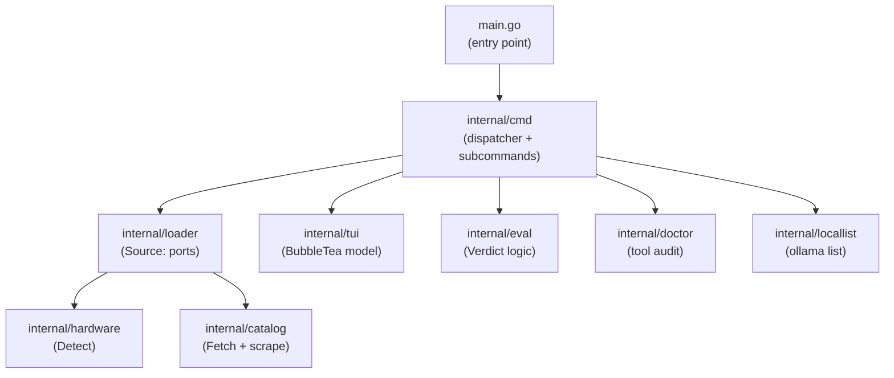

# ADR-0002: `cmd/` package extraction

**Date:** 2026-06-29  
**Status:** Accepted  
**Deciders:** Project team  

## Context

`main.go` has grown to ~330 lines and mixes five distinct responsibilities: CLI subcommand routing, adapter implementations (`execDoctorRunner`, `execLocalRunner`), output formatters (`fitReport`, `explainReport`, `hardwareSummary`), flag parsing (`parseFitFlags`), and domain orchestration (`runFit`, `runDoctor`, `runLocal`).

The project is a solo-maintained CLI tool (Go 1.23, goreleaser, single binary) at the "established and growing" stage — new subcommands are being added incrementally (`doctor`, `local`, `fit` were each recent additions). The `internal/` package decomposition (`catalog`, `hardware`, `eval`, `tui`, `loader`, `doctor`, `locallist`) is correct and should not change. `loader.Source` already implements a hexagonal-lite port pattern (function-type fields, `Default()` production adapter) — this is preserved.

The only structural problem is that `main.go` is the wrong unit of composition. It acts as a God file rather than an entry point.

## Decision

We extract all subcommand logic from `main.go` into `internal/cmd/`, one file per subcommand. `main.go` becomes a pure entry point (~15 lines).

```
main.go                 # os.Exit(cmd.Run(os.Args))
internal/
  cmd/
    root.go             # Run() dispatcher + TUI default flow
    fit.go              # runFit, fitOpts, parseFitFlags, fitReport, explainReport, hardwareSummary
    doctor.go           # runDoctor, execDoctorRunner
    local.go            # runLocal, execLocalRunner
    version.go          # printVersion
  catalog/              # unchanged
  hardware/             # unchanged
  eval/                 # unchanged
  tui/                  # unchanged
  loader/               # unchanged
  doctor/               # unchanged
  locallist/            # unchanged
```

All existing tests in `main_test.go` move to `internal/cmd/` alongside the symbols they test.

## Considered alternatives

| Alternative | Score | Reason not chosen |
|---|---:|---|
| `cmd/` extraction (this ADR) | 6/7 | Minimal delta; Go-idiomatic; fixes the God-file without touching working code |
| Full Clean Architecture | 3/7 | Q2:B (moderate domain) doesn't justify use-case/port/adapter layers on top of what already exists |
| Hexagonal / Ports & Adapters | 4/7 | `loader.Source` already covers the only real infra boundary; adding explicit ports for everything else is overhead for a solo CLI tool |
| Layered (N-Tier) | 3/7 | No testability story for CLI tools; layered thinking doesn't map cleanly to subcommand decomposition |
| Status quo | 0/7 | `main.go` will reach 500+ lines as subcommands grow; test symbols live in `package main` which limits reuse |

## Consequences

**Positive:**
- `main.go` becomes an unambiguous entry point — no logic to read or test there
- Each subcommand is independently testable without package `main`
- Adding a new subcommand = add one file in `internal/cmd/`, touch one switch/dispatch in `root.go`
- Q4:B (maintainability) and Q4:C (test coverage) both improve

**Negative:**
- Tests in `main_test.go` must move to `internal/cmd/` — one-time migration cost
- One additional internal package to import

## Implementation notes

### Dependency rules (enforced manually; add `go-arch-lint` if violations recur)

```
main          → internal/cmd only
internal/cmd  → internal/{loader,eval,catalog,hardware,tui,doctor,locallist}
internal/*    → must NOT import internal/cmd or main
```

Circular imports are a compile error in Go — the constraint is free to enforce.

### Migration plan

| Step | Status |
|---|---|
| Create `internal/cmd/` package with `root.go` (Run dispatcher) | done |
| Move `runFit` + related types/funcs to `internal/cmd/fit.go` | done |
| Move `runDoctor` + `execDoctorRunner` to `internal/cmd/doctor.go` | done |
| Move `runLocal` + `execLocalRunner` to `internal/cmd/local.go` | done |
| Move `printVersion` to `internal/cmd/version.go` | done |
| Slim `main.go` to entry-point only | done |
| Move `main_test.go` symbols to `internal/cmd/` test files | done |
| `go test ./...` passes | done — 296 tests, 0 failures |

### Adding a new subcommand (after migration)

1. Create `internal/cmd/<name>.go` with `run<Name>(args []string, src *loader.Source) int`
2. Add one case in `root.go`'s dispatcher
3. Done

## Architecture diagram



Arrows = import direction. Inner packages never import `cmd` or `main`.

## Review triggers

- Team grows past 2 engineers → consider splitting `internal/cmd/fit.go` formatter from orchestrator
- Fourth subcommand added → consider a `Command` interface if the dispatcher switch becomes unwieldy (>6 cases)
- `internal/cmd` exceeds ~600 lines → re-evaluate whether a use-case layer is warranted
